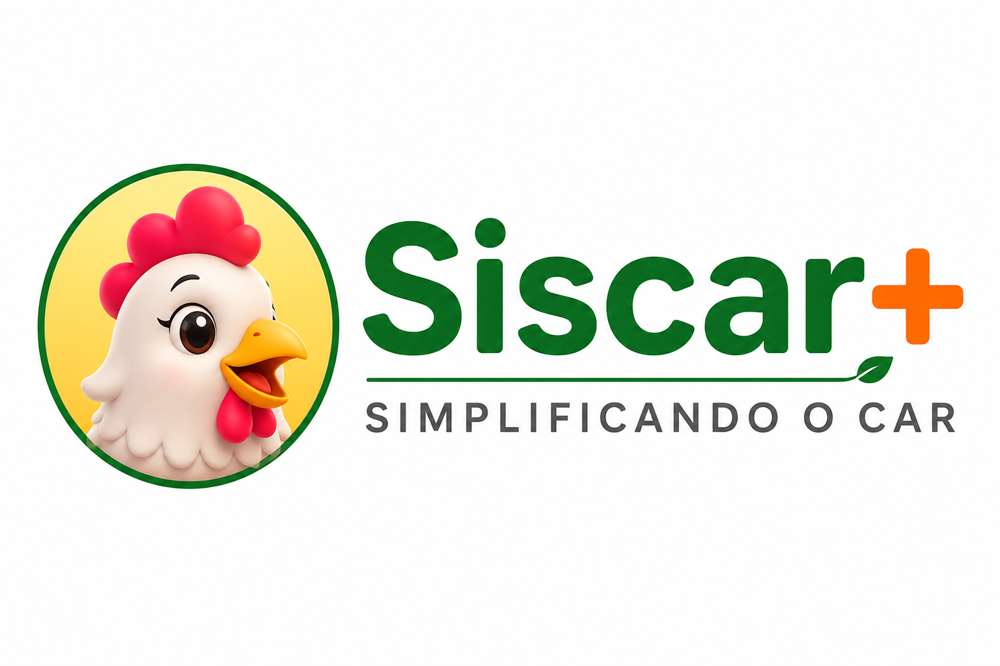

# 🚜 Siscar+ | Inteligência Ambiental e Acessibilidade no CAR

> **Desafio 3 (haCARthon):** Desenvolver soluções inovadoras para aumentar o entendimento da legislação ambiental pelos proprietários rurais, aproximando o cidadão do órgão fiscalizador de forma clara e humana.

---

## 🎨 Nossa Logo



## 🎨 Identidade Visual & Paleta de Cores

A identidade do **Siscar+** foi planejada para transmitir **confiança, sustentabilidade e proximidade com o produtor do campo**, equilibrando o verde da preservação ambiental com o calor e a energia do ecossistema agrícola.

### 🎨 Paleta de Cores Oficial

| Cor | Hexadecimal | Significado e Aplicação |
| :---: | :---: | :--- |
| **Verde Floresta** | `#007025` | Cor principal da marca (texto "Siscar"). Representa a vegetação nativa, o cumprimento da legislação ambiental e a sustentabilidade. |
| **Laranja Alerta** | `#FF6B00` | Destaque do símbolo "+" e alertas de urgência. Transmite ação, dinamismo e o destravamento do crédito rural. |
| **Amarelo Sol** | `#FFEB60` | Fundo do ícone da Cisca. Traz acolhimento, energia positiva e a clareza necessária para simplificar o "juridiquês". |
| **Cinza Mineral** | `#555555` | Utilizado na tipografia de suporte ("SIMPLIFICANDO O CAR"). Garante excelente legibilidade e neutralidade técnica. |

### 🐔 A Mascote: Cisca
A nossa mascote foi desenhada para quebrar a frieza dos sistemas governamentais tradicionais. A escolha de uma galinha simpática e expressiva gera identificação imediata com o cotidiano do produtor rural, transformando o atendimento em uma conversa amigável entre parceiros de campo

---

## 🐔 Conheça a Cisca!
O grande gargalo do Cadastro Ambiental Rural (CAR) não é a falta de vontade do produtor, mas a complexidade do "juridiquês" das notificações oficiais. Quando o **Seu Raimundo** recebe um alerta dizendo que *"infracionou o Artigo 61-A da Lei 12.651/2012"*, o medo paralisa o processo.

O **Siscar+** resolve isso humanizando a comunicação através da **Cisca**, uma assistente virtual focada na linguagem do campo, que traduz termos jurídicos em tarefas práticas e visuais.

---

## 🎬 Demonstrações em Vídeo

Preparamos duas demonstrações rápidas para você ver a nossa solução funcionando na prática:

*   **🚀 Pitch e Protótipo do Sistema (2 Minutos):**
    [Assista aqui ao nosso video da Solução](URL_DO_VIDEO) para ver como a nossa assistente interage com o produtor rural usando uma linguagem simples e acessível.
    
*   **📱 A Cisca no WhatsApp (Experiência Prática):** 
    <video src="https://github.com/user-attachments/assets/ab87b40b-8143-4acc-ba2c-19792108b15c" controls="controls" style="max-width: 100%; margin-top: 10px;"></video>

---

## 🌐 Link de Acesso Rápido
Para testar a aplicação rodando em tempo real sem precisar baixar o código, acesse o link do protótipo funcional:
👉 **[Demonstração Online - Siscar+](https://soubeatrizkaroline.github.io/HaCARthon_Ciscar/)**

⚠️ **Nota sobre a Visualização do Protótipo:** Como o design foi projetado sob a filosofia *Mobile-First* (focado em dispositivos móveis) e está em fase de validação, caso você o acesse por um monitor ou tela de alta resolução, **pode ser necessário ajustar o zoom do seu navegador (para menos ou para mais)** para obter a melhor experiência de layout. Essa calibração de responsividade desktop será refinada e ajustada automaticamente nas próximas versões!

---

## ✨ Funcionalidades em Destaque

*   **Modo HaCARthon Interativo:** Painel acoplado para simular em tempo real 4 cenários estratégicos da jornada do usuário para a banca avaliadora.
*   **Tradução Simultânea da Lei:** Transforma artigos complexos em analogias simples (ex: *"A APP funciona como os cílios dos nossos olhos: protege a água do rio"*).
*   **Mapa de Bolso Didático:** Um micro-mapa dinâmico e simplificado que destaca as áreas de preservação a recuperar de forma lúdica.
*   **Plano de Ação Passo a Passo:** Transforma a pendência em uma lista de tarefas compreensíveis para o produtor familiar (ex: cercar o córrego, plantar mudas).
*   **Acesso Simplificado:** Interface inspirada nos aplicativos mais utilizados no ecossistema móvel do campo, com suporte a Login Gov.br.

---

## 🛠️ Tecnologias Utilizadas

Para garantir máxima performance, leveza de carregamento em redes móveis rurais (3G/4G) e zero dependência de infraestruturas caras de servidor nesta fase de validação, utilizamos:

*   **HTML5** - Estruturação semântica e acessível.
*   **CSS3** - Design responsivo (estilo *Mobile-First*) com variáveis customizadas para Modo Escuro/Painéis.
*   **JavaScript (Vanilla)** - Motor de estados lógico, simulação do fluxo de IA e reatividade sem frameworks pesados.
* **JSON (JavaScript Object Notation)** - Modelagem e armazenamento dos dados estruturados (diálogos da Cisca e cenários de testes), simulando o comportamento de uma API real de forma estática.
*   **Google Material Icons & Inter Font** - Identidade visual moderna e legibilidade garantida.
* **Inteligência Artificial (Refinamento e Geração de Imagens)** - Utilização pontual de modelos de linguagem (GPT e Gemini) para suporte no refinamento e concepção de modelos generativos como ferramentas auxiliares na geração dos elementos visuais e identidade da mascote.

---

## 🚦 Cenários de Validação (Modo Pitch)

O protótipo conta com um **Controlador de Cenários** integrado para demonstrar a robustez da solução aos avaliadores:

| Cenário | Foco da Demonstração | Benefício Percebido |
| :--- | :--- | :--- |
| **1. CAR em Análise** | Conforto e clareza para o produtor na fila de espera. | Redução da ansiedade e suporte passivo. |
| **2. Pendência de APP** | Tradução visual e textual de uma irregularidade real. | Engajamento do produtor em resolver o problema. |
| **3. Regularizado** | Conexão do sucesso ambiental com o ganho financeiro. | Estímulo ao Crédito Rural facilitado. |
| **4. Visão da Analista** | Métricas de impacto para o Órgão Ambiental do Estado. | Redução drástica nas filas de atendimento físico. |

---

## 📂 Estrutura do Projeto

```Project
├── index.html          # Estrutura de telas do smartphone e painel do hackathon
├── styles.css          # Estilização completa, variáveis de cor e animações
├── script.js           # Lógica dos cenários, mensagens da Cisca e interações
├── perguntas.json          # Dados estruturados com as falas da Cisca e cenários
└── logo.png            # Identidade visual oficial da marca

---

## 📦 Como Executar Localmente

Como o projeto preza pela leveza e arquitetura limpa, você não precisa instalar nenhuma dependência de pacotes (`npm`, `yarn`, etc.).

1. Clone o repositório para sua máquina local:
   ```bash
   git clone [https://github.com/soubeatrizkaroline/HaCARthon_Ciscar.git](https://github.com/soubeatrizkaroline/HaCARthon_Ciscar.git)
